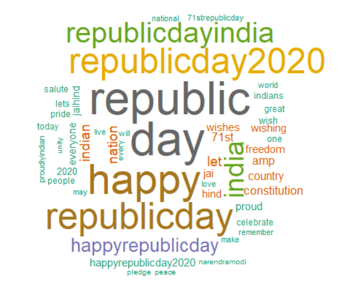
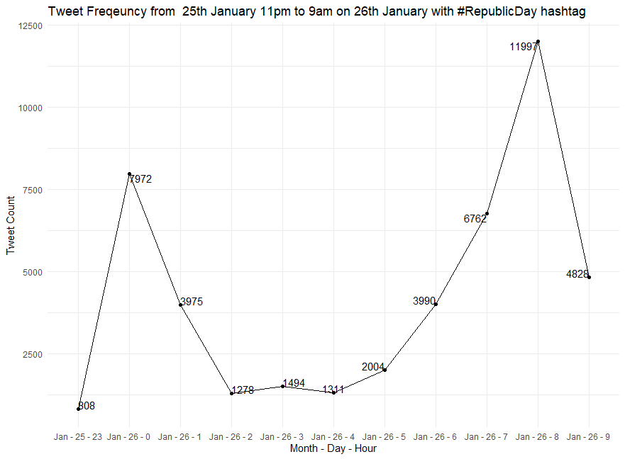

# Real-time Twitter Dataset Builder

This repository can be used to create multiple twitter datasets by streaming real-time tweets, based on #hashtags, into a database that is further transformed to a .csv file for further classification and analysis.

As of now by using this repository, one can fetch Twitter handle, Tweet content and the DateTime of the tweet to a dataset but there are many more options which can be included in the dataset by adding new parameters in the code like language of the tweet, location of the tweet, followers count of a handle, if a tweet is a retweet or not, and much more.

## My Scenario
Below is my scenario where I created my own dataset from real-time tweets and how I used it to analyze things.

On the occasion of 71st Republic Day of India, I was interested in knowing the words besides the Republic Day which people would use in their Tweets and maybe conclude something from that data, considering a lot of political instability is seen at this point of time in India.

To achieve this, I created a realtime tweet extraction pipeline in R streaming all the tweets with the hashtag "#RepublicDay, #26th, #26thJan, #26thJanuary, #Republic, #71st, #HappyRepublicDay, #71stRepublicDay, #RepublicDay2020, #RepublicDayIndia" into my SQLite database and converting it to a .csv file. Yes, by realtime I mean realtime. I was extracting and loading all the tweets, which had any of the one hashtags from the list mentioned above, into my Database for 9 hours non stop. I started streaming live tweets from 25th Jan 11 pm IST up until 26th Jan 9 am IST approximately.

I was able to extract 46000+ tweets in 9 hours. To be honest, I was expecting at least 100K+ tweets but I guess the Twitter API only allows access to some percent of the total tweets being posted.

## End result
To conclude, I've created a wordcloud showing the top 50 words used among those 46000+ tweets and a line ggplot showing the number of tweets being posted every hour from 11 pm to 9 am. 

  
  

